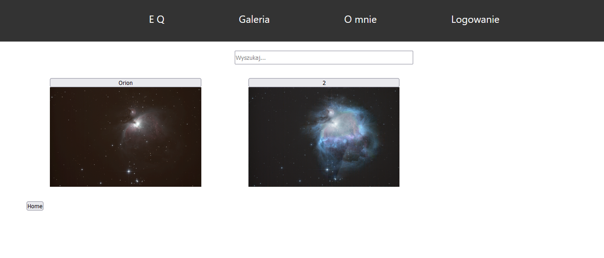
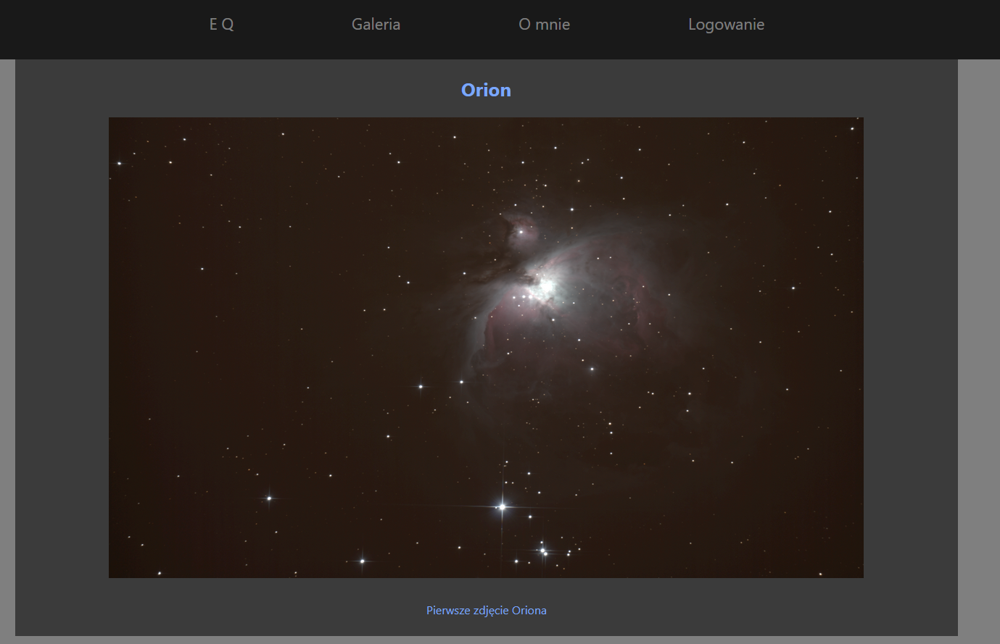
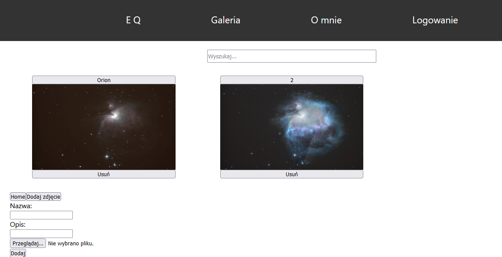

# MyAstroApp

> This site is my private project to upload my astronomy photos. This project was created to learn how to conect React with Nodejs 
> Live demo [_here_](https://myastroapp.herokuapp.com/)
## Table of Contents
* [General Info](#general-information)
* [Technologies Used](#technologies-used)
* [Features](#features)
* [Screenshots](#screenshots)
* [Setup](#setup)


## General Information
This project was created to practice my skills in React and NodeJS. It can be used to store photos.

## Technologies Used
- NodeJS 14.15.0
- ReactJS
- MongoDB
- Amazon Simple Storage Service (AWS S3)

## Features
List the ready features here:
- Adding and removing categories, objects or photos
- Photos are storeged on Cloud Service

## Screenshots





## Setup
To run this project, install it locally using npm:
```
$ npm install 
$ npm start 
$ cd client
$ npm install 
$ npm start 
```
